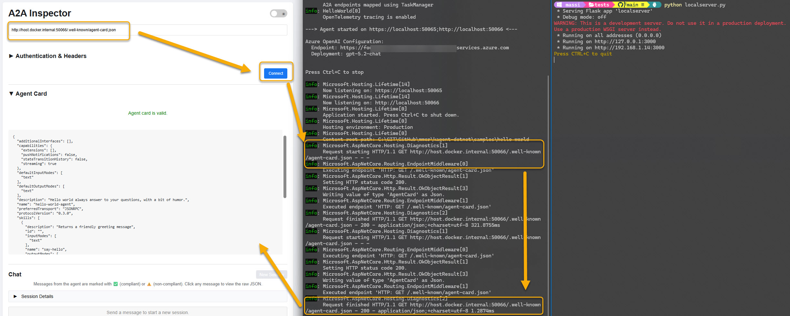
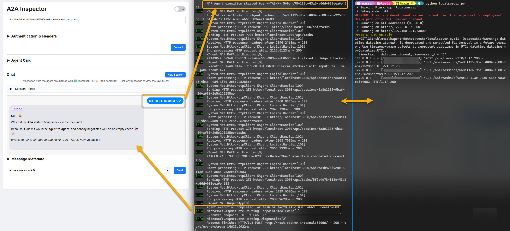
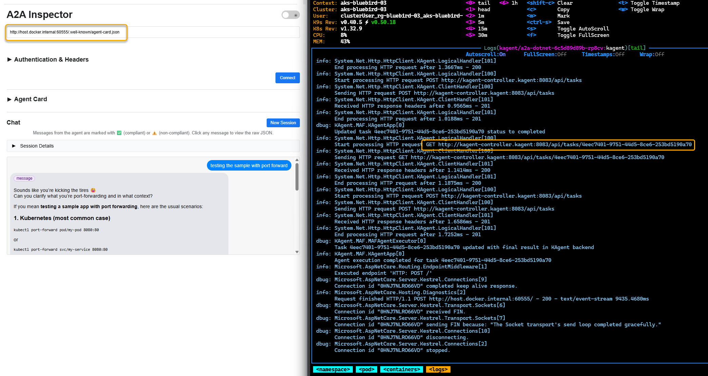
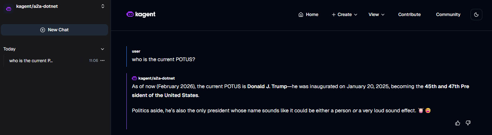

# Kagent dotnet

This document provides a guide to all documentation in the kagent-dotnet repository.
> ℹ️ This codebase is intended for experimental and development use.

## Quick Start

What's in this repo?
1. [kagent-core README](core/) - KAgent.Core provides the foundational infrastructure to integrate with the KAgent backend (.NET version of [kagent-core](https://github.com/kagent-dev/kagent/tree/main/python/packages/kagent-core)).
2. [kagent-maf README](kagent-maf/src/) - Kagent library for Microsoft Agent Framework. 
3. [hello-world-agent SAMPLE](samples/hello-world/) - Working example. Create a BYO agent with Microsoft Agent Framework.

---

# BYO example

Clone the code repository,  build the custom agent image and push it to your preferred registry. 

```sh
git clone https://github.com/MassimoC/kagent-dotnet.git
cd kagent-dotnet
```

## Package

Build the custom agent image and push it to your preferred registry. 

```sh
docker build . -f samples/hello-world/Dockerfile -t massimocrippa/hello-world-agent:latest --build-arg VERSION=latest --push
```

## Deploy

create a secret for your API key

```sh
export AZURE_FOUNDRY_OPENAI_API_KEY=your-api-key-here
kubectl create secret generic foundry-azureopenai --from-literal=AZURE_FOUNDRY_OPENAI_API_KEY=$AZURE_FOUNDRY_OPENAI_API_KEY -n kagent
```

```sh
kubectl apply -f - <<EOF
apiVersion: kagent.dev/v1alpha2
kind: Agent
metadata:
  name: a2a-dotnet
  namespace: kagent
spec:
  description: a2a dotnet helloworld
  type: BYO
  byo:
    deployment:
      image: massimocrippa/hello-world-agent:latest
      env:
        - name: AZURE_OPENAI_ENDPOINT
          value: "https://ms-foundry-78.cognitiveservices.azure.com"
        - name: AZURE_OPENAI_DEPLOYMENT_NAME
          value: "gpt-5.2-chat"
        - name: DOTNET_URLS
          value: "http://0.0.0.0:8080"
        - name: AZURE_FOUNDRY_OPENAI_API_KEY
          valueFrom:
            secretKeyRef:
              name: foundry-azureopenai
              key: AZURE_OPENAI_API_KEY
        - name: OTEL_TRACING_ENABLED
          value: "true"
        - name: OTEL_TRACING_EXPORTER_OTLP_ENDPOINT
          value: "http://jaeger.telemetry.svc.cluster.local:4317"
EOF
```

## Test

The easiest way to test A2A compatibility and verify that your endpoint conforms to the A2A specification is to use the A2A Inspector.

```
docker run -d -p 9999:8080 a2a-inspector
```

### Local test without kagent

Set the env variables and run the hello-world sample agent

```
# Required: Azure OpenAI Configuration
$env:AZURE_OPENAI_ENDPOINT = "https://something.cognitiveservices.azure.com"
$env:AZURE_OPENAI_DEPLOYMENT_NAME = "gpt-5.2-chat"
$env:AZURE_FOUNDRY_OPENAI_API_KEY = "000000000000000000000000000"

# Optional: KAgent backend configuration
$env:KAGENT_URL = "http://localhost:3000"
$env:KAGENT_NAME = "hello-world"
$env:KAGENT_NAMESPACE = "samples"
$env:ENABLE_INMEMORYEVENTQUEUE = 1

cd samples/hello-world
dotnet run

```
Run a mock http server that listen on port 3000 to simulate the kagent internal API

```
cd tests
python localserver.py
```

get the agent card



interact with the sample agent



### Test with port forward

Port forward to the deployed BYO agent

```sh
export POD_NAME=$(kubectl get pods --namespace kagent -l "app.kubernetes.io/managed-by=kagent,app.kubernetes.io/name=a2a-dotnet" -o jsonpath="{.items[0].metadata.name}")
kubectl port-forward --namespace kagent $POD_NAME 60555:8080
```

test with the A2A inspector

```
http://host.docker.internal:60555/.well-known/agent-card.json
```

triggered from a2a-inspector, executed on Azure Kubernetes Service




### Test with Kagent UI

Open the kagent dashboard to discover your agents and interact with them.


